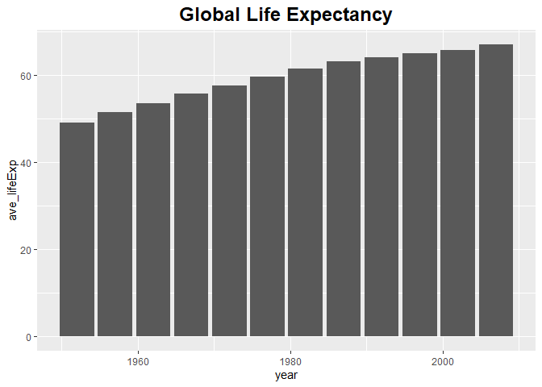
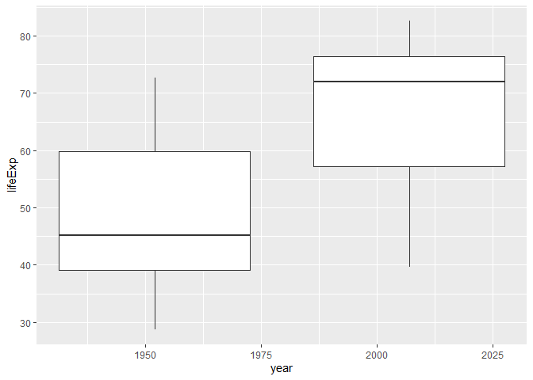
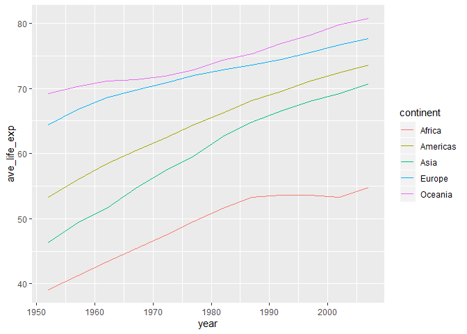
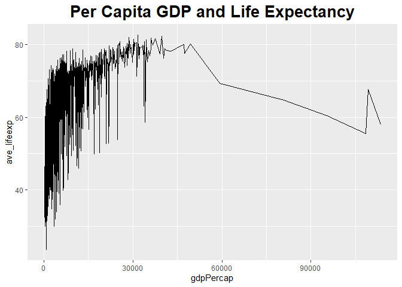
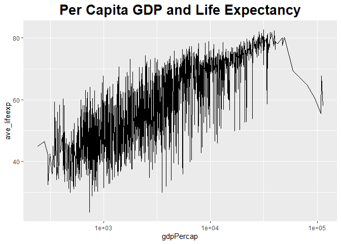
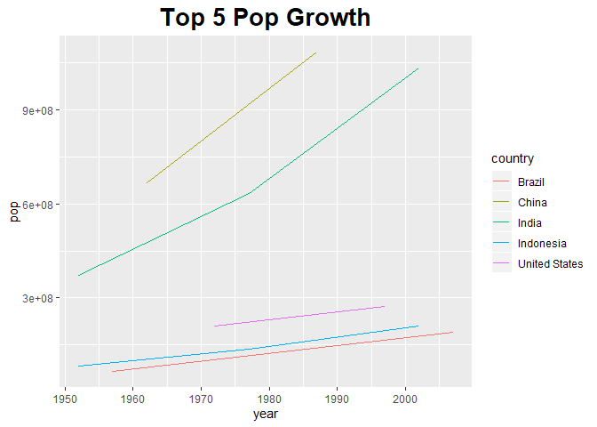
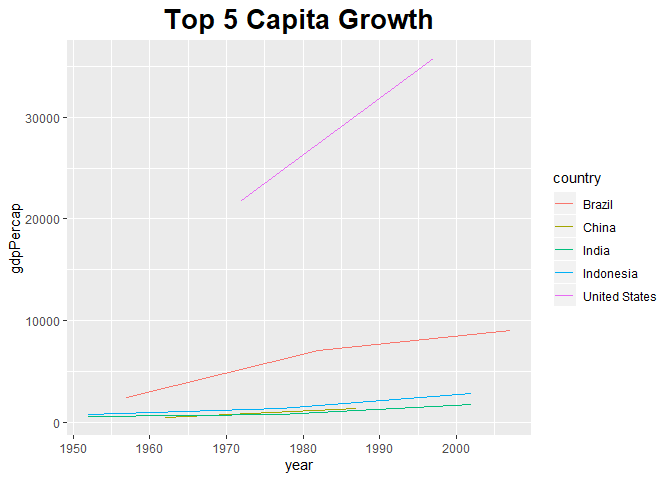

## Instructions
Answer the following questions and complete the exercises in RMarkdown. Please embed all of your code and push your final work to your repository. Your final lab report should be organized, clean, and run free from errors. Remember, you must remove the `#` for any included code chunks to run.  

## Libraries

```r
library(tidyverse)
```

## Resources
The idea for this assignment came from [Rebecca Barter's](http://www.rebeccabarter.com/blog/2017-11-17-ggplot2_tutorial/) ggplot tutorial so if you get stuck this is a good place to have a look.  

## Gapminder
For this assignment, we are going to use the dataset [gapminder](https://cran.r-project.org/web/packages/gapminder/index.html). Gapminder includes information about economics, population, and life expectancy from countries all over the world. You will need to install it before use. This is the same data that we used for the practice midterm. You may want to load that assignment for reference.  

```r
#install.packages("gapminder")
library("gapminder")
```

```
## Warning: package 'gapminder' was built under R version 3.6.2
```

## Questions
The questions below are open-ended and have many possible solutions. Your approach should, where appropriate, include numerical summaries and visuals. Be creative; assume you are building an analysis that you would ultimately present to an audience of stakeholders. Feel free to try out different `geoms` if they more clearly present your results.  

**1. Use the function(s) of your choice to get an idea of the overall structure of the data frame, including its dimensions, column names, variable classes, etc. As part of this, determine how NAs are treated in the data.**  


```r
gapminder
```

```
## # A tibble: 1,704 x 6
##    country     continent  year lifeExp      pop gdpPercap
##    <fct>       <fct>     <int>   <dbl>    <int>     <dbl>
##  1 Afghanistan Asia       1952    28.8  8425333      779.
##  2 Afghanistan Asia       1957    30.3  9240934      821.
##  3 Afghanistan Asia       1962    32.0 10267083      853.
##  4 Afghanistan Asia       1967    34.0 11537966      836.
##  5 Afghanistan Asia       1972    36.1 13079460      740.
##  6 Afghanistan Asia       1977    38.4 14880372      786.
##  7 Afghanistan Asia       1982    39.9 12881816      978.
##  8 Afghanistan Asia       1987    40.8 13867957      852.
##  9 Afghanistan Asia       1992    41.7 16317921      649.
## 10 Afghanistan Asia       1997    41.8 22227415      635.
## # ... with 1,694 more rows
```


```r
glimpse(gapminder)
```

```
## Observations: 1,704
## Variables: 6
## $ country   <fct> Afghanistan, Afghanistan, Afghanistan, Afghanistan, ...
## $ continent <fct> Asia, Asia, Asia, Asia, Asia, Asia, Asia, Asia, Asia...
## $ year      <int> 1952, 1957, 1962, 1967, 1972, 1977, 1982, 1987, 1992...
## $ lifeExp   <dbl> 28.801, 30.332, 31.997, 34.020, 36.088, 38.438, 39.8...
## $ pop       <int> 8425333, 9240934, 10267083, 11537966, 13079460, 1488...
## $ gdpPercap <dbl> 779.4453, 820.8530, 853.1007, 836.1971, 739.9811, 78...
```

```r
anyNA(gapminder)
```

```
## [1] FALSE
```


```r
gapminder%>%
  na_if(" ")%>%
  na_if("-999")%>%
  anyNA()
```

```
## [1] FALSE
```


**2. Among the interesting variables in gapminder is life expectancy. How has global life expectancy changed between 1952 and 2007?**


```r
gapminder%>%
  group_by(year)%>%
  summarise(ave_lifeExp= mean(lifeExp))%>%
  ggplot(aes(x= year, y= ave_lifeExp))+
  geom_bar(stat = "identity")+
  labs(title = "Global Life Expectancy")+
  theme(plot.title = element_text(size = 18, hjust = .5, face = "bold"))
```

<!-- -->

###life expectancy has increased from about 50 to almost 70 years

**3. How do the distributions of life expectancy compare for the years 1952 and 2007? _Challenge: Can you put both distributions on a single plot?_**


```r
gapminder%>%
  filter(year== 1952 | year== 2007)%>%
  ggplot(aes(x=year, y= lifeExp, group = year))+
  geom_boxplot()
```

<!-- -->


**4. Your answer above doesn't tell the whole story since life expectancy varies by region. Make a summary that shows the min, mean, and max life expectancy by continent for all years represented in the data.**


```r
gapminder%>%
  select(year, continent, lifeExp)%>%
  group_by(continent, year)%>%
  summarise(min_life_exp = min(lifeExp), max_life_exp= max(lifeExp), ave_life_exp= mean(lifeExp))
```

```
## # A tibble: 60 x 5
## # Groups:   continent [5]
##    continent  year min_life_exp max_life_exp ave_life_exp
##    <fct>     <int>        <dbl>        <dbl>        <dbl>
##  1 Africa     1952         30           52.7         39.1
##  2 Africa     1957         31.6         58.1         41.3
##  3 Africa     1962         32.8         60.2         43.3
##  4 Africa     1967         34.1         61.6         45.3
##  5 Africa     1972         35.4         64.3         47.5
##  6 Africa     1977         36.8         67.1         49.6
##  7 Africa     1982         38.4         69.9         51.6
##  8 Africa     1987         39.9         71.9         53.3
##  9 Africa     1992         23.6         73.6         53.6
## 10 Africa     1997         36.1         74.8         53.6
## # ... with 50 more rows
```


**5. How has life expectancy changed between 1952-2007 for each continent? Try using `geom_line()` for this, including all continents on the same  plot.**


```r
gapminder%>%
  select(year, continent, lifeExp)%>%
  group_by(continent, year)%>%
  summarise(min_life_exp = min(lifeExp), max_life_exp= max(lifeExp), ave_life_exp= mean(lifeExp))%>%
  ggplot(aes(x=year, y=ave_life_exp, color= continent))+
  geom_line()
```

<!-- -->


**6. We are interested in the relationship between per capita GDP and life expectancy; i.e. does having more money help you live longer?**


```r
gapminder%>%
  group_by(year, gdpPercap)%>%
  summarise(ave_lifeexp= mean(lifeExp))%>%
  ggplot(aes(x=gdpPercap, y= ave_lifeexp))+
  geom_line()+
  labs(title = "Per Capita GDP and Life Expectancy")+
  theme(plot.title = element_text(size = 20, hjust = .5, face = "bold"))
```

<!-- -->
####Not really but this graph makes it clear that having very little money doesn't help you live longer


**7. There is extreme disparity in per capita GDP. Rescale the x axis to make this easier to interpret. How would you characterize the relationship?**


```r
gapminder%>%
  group_by(year, gdpPercap)%>%
  summarise(ave_lifeexp= mean(lifeExp))%>%
  ggplot(aes(x=gdpPercap, y= ave_lifeexp))+
  geom_line()+
  scale_x_log10()+
  labs(title = "Per Capita GDP and Life Expectancy")+
  theme(plot.title = element_text(size = 20, hjust = .5, face = "bold"))
```

<!-- -->
###There appears to be a positive relationship with higher GDP and longer life expectancy


**8. Which countries have had the largest population growth since 1952?**


```r
Top_5  <-  
  gapminder%>%
  group_by(country)%>%
  summarise(Popgrowth= max(pop) - min(pop))%>%
  arrange(desc(Popgrowth))%>%
  head(n=5)
Top_5
```

```
## # A tibble: 5 x 2
##   country       Popgrowth
##   <fct>             <int>
## 1 China         762419569
## 2 India         738396331
## 3 United States 143586947
## 4 Indonesia     141495000
## 5 Brazil        133408087
```


**9. Use your results from the question above to plot population growth for the top five countries since 1952.**

```r
gapminder%>%
  filter(country== c("China", "India", "United States", "Indonesia", "Brazil"))%>%
  ggplot(aes(x=year, y=pop, color= country))+
  geom_line()+
  labs(title = "Top 5 Pop Growth")+
  theme(plot.title = element_text(size = 20, hjust = .5, face = "bold"))
```

```
## Warning in `==.default`(country, c("China", "India", "United States",
## "Indonesia", : longer object length is not a multiple of shorter object
## length
```

```
## Warning in is.na(e1) | is.na(e2): longer object length is not a multiple of
## shorter object length
```

<!-- -->


**10. How does per capita GDP growth compare between these same five countries?**


```r
gapminder%>%
  select(year, country, gdpPercap)%>%
  filter(year >= 1952)%>%
  filter(country== c("China", "India", "United States", "Indonesia", "Brazil"))%>%
  ggplot(aes(x=year, y=gdpPercap, color= country))+
  geom_line()+
  labs(title = "Top 5 Capita Growth")+
  theme(plot.title = element_text(size = 20, hjust = .5, face = "bold"))
```

```
## Warning in `==.default`(country, c("China", "India", "United States",
## "Indonesia", : longer object length is not a multiple of shorter object
## length
```

```
## Warning in is.na(e1) | is.na(e2): longer object length is not a multiple of
## shorter object length
```

<!-- -->


## Push your final code to GitHub!
Please be sure that you check the `keep md` file in the knit preferences. 
